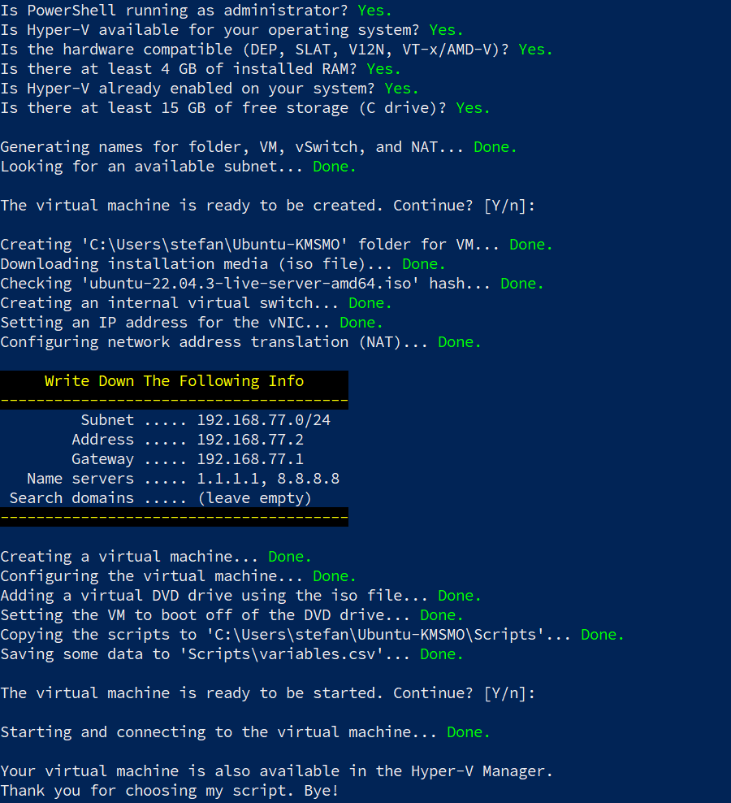
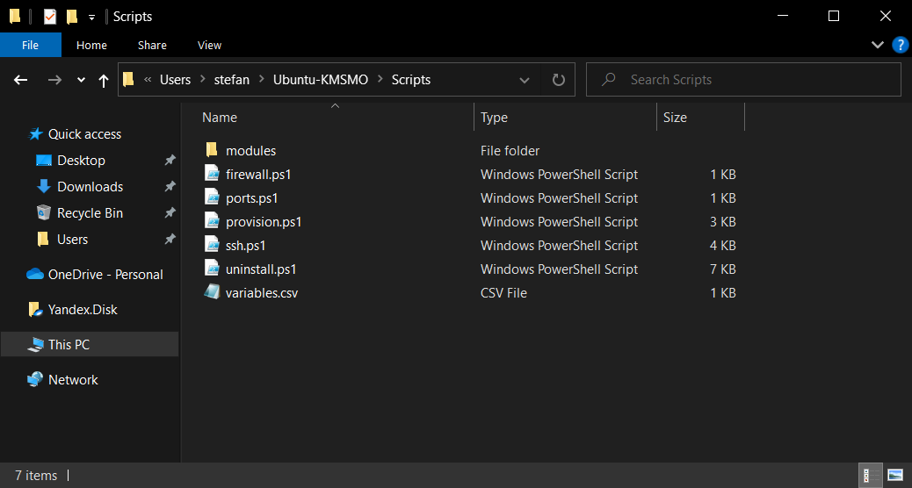
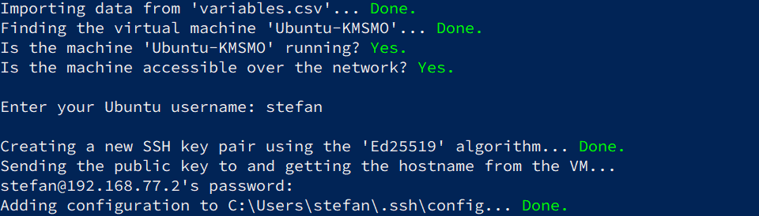
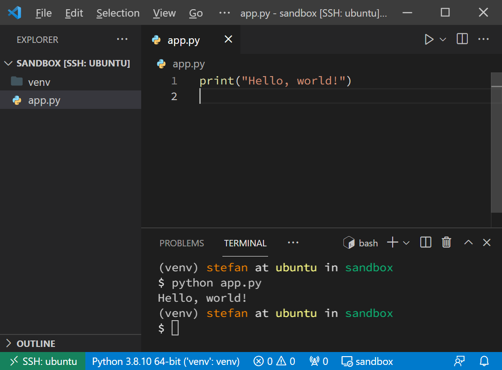
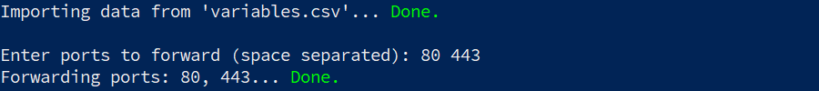
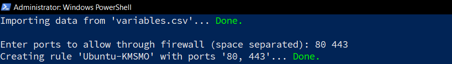
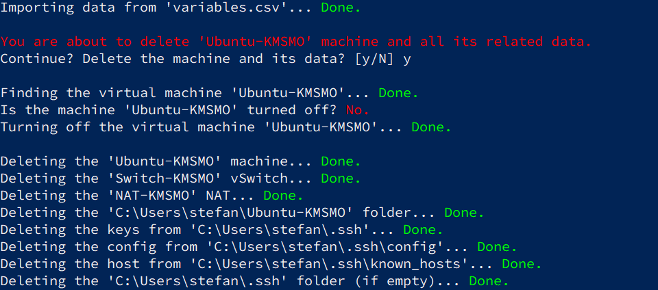

## Step 1: Create Virtual Machine

Open [PowerShell as Administrator](https://www.top-password.com/blog/5-ways-to-run-powershell-as-administrator-in-windows-10/) and run the following code to download this repository as an archive, unzip it and execute the `create.ps1` script:

```powershell
$RepositoryUrl = "https://raw.githubusercontent.com/mrguseinov/machine"
$InstallScriptUrl = "$RepositoryUrl/main/hyper-v/install.ps1"
Invoke-Expression (New-Object System.Net.WebClient).DownloadString($InstallScriptUrl)
```

The `create.ps1` script will do the following:

- check many software and hardware requirements;
- generate random names for your new virtual machine, virtual switch and NAT;
- find an available subnet in the `192.168.0.0–192.168.255.0` range;
- ask if you want to continue or abort (nothing has been changed or created so far);
- download the Ubuntu Server 22.04.2 installation media and check its hash;
- configure a network with a static IP address and internet access (internal virtual switch, virtual network adapter, network address translation);
- create and configure the virtual machine;
- add a virtual DVD drive and set the machine to boot from it;
- copy some scripts to the `Scripts` folder (see below);
- ask if you want to start the virtual machine and connect to it.

If you've met all the requirements, you should see a similar output:



The `$HOME/Ubuntu-XXXXX/Scripts` folder contains a number of scripts. You can use them in the next steps.



To run a script, right-click it and select `Run with PowerShell`.

---

## Step 2: Install Ubuntu Server

The installation process [can also be automated](https://askubuntu.com/q/1293460), but I'll put this idea on ice until better times :)

```
      Grub menu  →  Try or Install Ubuntu Server. (This might take a few minutes.)
       Language  →  English.
       Keyboard  →  Layout: 'Russian'. Variant: 'Russian'.
  Layout toggle  →  Alt+Shift.
Type of install  →  Ubuntu Server.
        Network  →  Select an adapter (for example, 'eth0'), then 'Edit IPv4',
                    then 'IPv4 Method: Manual', then fill out the fields using
                    the output from the Step 1.
          Proxy  →  Skip (press 'Done').
 Archive mirror  →  Skip (press 'Done').
        Storage  →  Use an entire disk: 'Yes'. Set up this disk as an LVM group: 'No'.
                    (Note: The swap file will be created by Ubuntu automatically.)
                    Press 'Done', then 'Done' again, then 'Continue'.
        Profile  →  Fill out everything as you like.
      SSH setup  →  Install OpenSSH server: 'Yes'. Import SSH identity: 'No'.
   Server snaps  →  Skip (press 'Done').
```

After rebooting, you'll be prompted to remove the installation media. Just hit `Enter`.

## Step 3: Provision Ubuntu Server

Use the `provision.ps1` script in this step. It will check if the machine is available, running (if not, the script will try to start it), and accessible over the network. Then connect to it, clone the repository, and run the `bootstrap.py` script.

The `bootstrap.py` script will do the following:

- update packages list and packages themselves;
- install [pip](https://github.com/pypa/pip), [virtualenv](https://github.com/pypa/virtualenv) and [black](https://github.com/psf/black);
- [detect](https://ipinfo.io/json) and change the time zone;
- install [dotfiles](https://github.com/mrguseinov/machine/tree/main/ubuntu/dotfiles) and SSH [config](https://github.com/mrguseinov/machine/tree/main/ubuntu/ssh) (be sure to review those files, especially `.gitconfig` and `.ssh/config`);
- create some folders, set some permissions and remove unused dependencies.

---

## Step 4: Configure SSH Connection

Use the `ssh.ps1` script in this step. You should see a similar output:



Now you should be able to connect to the server without passwords and also from the [VS Code](https://code.visualstudio.com/docs/remote/ssh).



---

## Step 5: Forward Ports

Use the `ports.ps1` script to forward ports from Windows to Ubuntu. You should see a similar output:



---

## Step 6: Configure Firewall

Use the `firewall.ps1` script to set up the Windows Firewall. You should see a similar output:



---

## How To Uninstall?

Use the `uninstall.ps1` script:



Everything created by the `install.ps1` should now be deleted. However, it'll not [disable Hyper-V](https://petri.com/how-to-disable-hyper-v-completely-in-windows-10).
