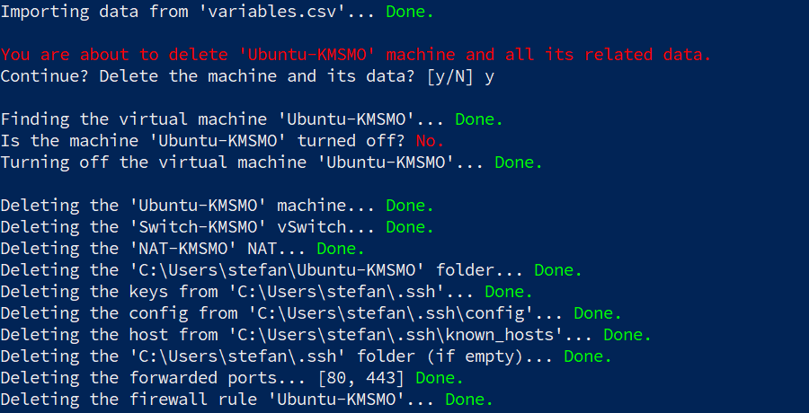

## Step 1: Create Virtual Machine

Open [PowerShell as admin](https://www.top-password.com/blog/5-ways-to-run-powershell-as-administrator-in-windows-10/) and run the following code to install and run the `create.ps1` script:

```powershell
$RepositoryUrl = "https://raw.githubusercontent.com/mrguseinov/machine"
$InstallScriptUrl = "$RepositoryUrl/main/hyper-v/install.ps1"
Invoke-Expression (New-Object System.Net.WebClient).DownloadString($InstallScriptUrl)
```

The `create.ps1` script will do the following:

- check many software and hardware requirements;
- generate random names for the virtual machine, virtual switch and NAT;
- find an available subnet in the `192.168.0.0–192.168.255.0` range;
- ask if you want to continue or abort (nothing has been changed or created so far);
- download the Ubuntu Server 20.04 installation media and check its hash;
- configure a network with a static IP address and internet access (internal virtual switch, virtual network adapter, network address translation);
- create and configure the virtual machine itself;
- add a virtual DVD drive and set the machine to boot from it;
- copy the `ssh.ps1`, `provision.ps1` and `uninstall.ps1` scripts to the `Scripts` folder;
- ask if you want to start and connect to the virtual machine.

If you've met all the requirements, you'll see a similar output:


The `$HOME/Ubuntu-XXXXX/Scripts` folder contains three scripts, that you can use in the next steps.


To run a script, right-click it and select `Run with PowerShell`.

---

## Step 2: Install Ubuntu Server

The installation process [can also be automated](https://askubuntu.com/q/1293460), but I'll put this idea on ice until better times.

```
Grub menu             → Install Ubuntu Server.
Language              → English.
Keyboard              → Layout: Russian. Variant: Russian.
Layout toggle         → Alt+Shift.
Network               → Manual IPv4 (see the output of the 'install.ps1' script).
Proxy                 → Skip.
Ubuntu archive mirror → Skip.
Installer update      → Update to the new installer.
Storage               → Use an entire disk. No LVM group. (Swap is created by Ubuntu.)
Profile               → Fill out everything as you like.
SSH setup             → Install OpenSSH server: Yes. Import SSH identity: No.
Featured server snaps → Skip.
Security updates      → Skip. We'll install them later in Step 3.
```

## Step 3: Provision Ubuntu Server

Use the `provision.ps1` script in this step. You'll see a similar output:


---

## Step 4: Configure SSH Connection

Use the `ssh.ps1` script in this step. You'll see a similar output:


Now you should be able to connect to the server without passwords and also from the [VS Code](https://code.visualstudio.com/docs/remote/ssh).


---

## How To Uninstall?

Use the `uninstall.ps1` script in this step. You'll see a similar output:



Everything created by the `install.ps1` should now be deleted. However, it'll not [disable Hyper-V](https://petri.com/how-to-disable-hyper-v-completely-in-windows-10).
